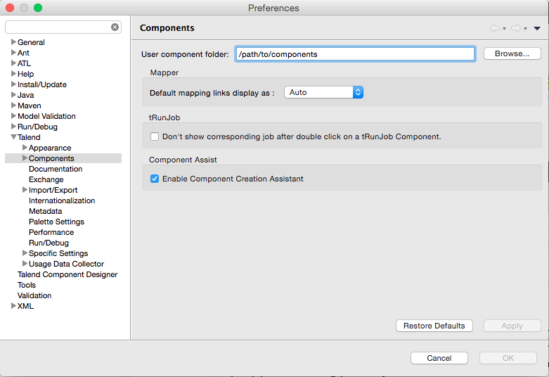
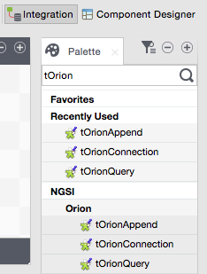
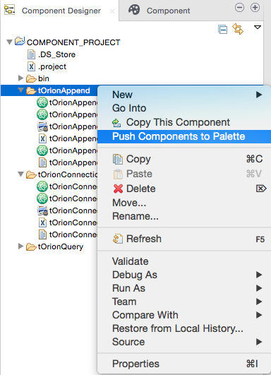

#<a name="top"></a>Configuring Talend Open Studio
This section of the manual describes how to configure Talend Open Studio (TOS) in order to add to the Palette the custom components developed for Telefónica's IoT Platform.

It is supposed a TOS is already installed. It is not in the scope of this document to guide you through the installation process. Please, check the Talend [documentation](https://www.talend.com/download/talend-open-studio). It is important to download and install the Data Integration flavour of TOS.

[Top](#top)

##Setting TOS preferences
Open TOS and click *Window* in the toolbar, then follow this path: *Preferences > Talend > Component*. Then, simply configure the *User component folder* with a folder of your choice:



Finally, press *OK* to confirm.

[Top](#top)

##Downloading and installing the components
There are two ways of downloading our custom components: [Talend Exchange](https://exchange.talend.com/) and [Github](https://github.com/telefonicaid/iotp-talend-connectors).

###From Talend Exchange
Coming soon.

[Top](#top)

###From Github
This way of downloading the components requires [Git](https://git-scm.com/) installed in your system.

Start by cloning the [iotp-talend-connectors]((https://github.com/telefonicaid/iotp-talend-connectors)) Github repository somewhere in your file system:

```
$ git clone https://github.com/telefonicaid/iotp-talend-connectors.git
Cloning into 'iotp-talend-connectors'...
remote: Counting objects: 137, done.
remote: Compressing objects: 100% (79/79), done.
remote: Total 137 (delta 43), reused 118 (delta 40), pack-reused 0
Receiving objects: 100% (137/137), 813.54 KiB | 72.00 KiB/s, done.
Resolving deltas: 100% (43/43), done.
Checking connectivity... done.
```

Then, change directory to `iotp-talend-connectors` and change to the `develop` branch (at the moment of writting this there is no official release yet):

```
$ cd iotp-talend-connectors/
$ git checkout develop
Branch develop set up to track remote branch develop from origin.
Switched to a new branch 'develop'
```

The custom components are under `components/` subfolder:

```
$ ls components/
tOrionAppend		tOrionConnection
```

In order to install them, simply copy the content of `components/` to the *User component folder* you specified when setting TOS preferences.

```
$ cp -r components/* /path/to/components
```

[Top](#top)

##Checking the Palette
The new added components must appear in the *Palette* if looking by the *tOrion* key word:



[Top](#top)

##Troubleshooting
If the components don't appear in the *Palette*, try the following:

1. Delete the components cache of TOS. This is a file named `ComponentsCache.javacache` under `/path/to/TOS/configuration` folder.
2. Open the *Component Designer* view of TOS: click *Window* in the toolbar, then follow this path: *Perspective > Component Designer*.
3. In the *Component Designer* tab in the left, move the mouse over the components, click right and click *Push Components to Palette*.
4. Return to the *Integration* view: click *Window* in the toolbar, then follow this path: *Perspective > Integration*.
<br>

<br>
5. Check the components are now in the *Palette*.

[Top](#top)
